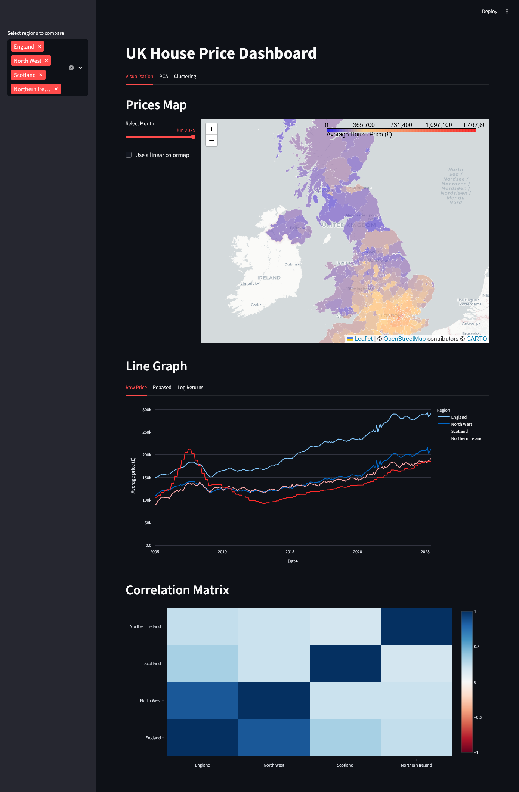
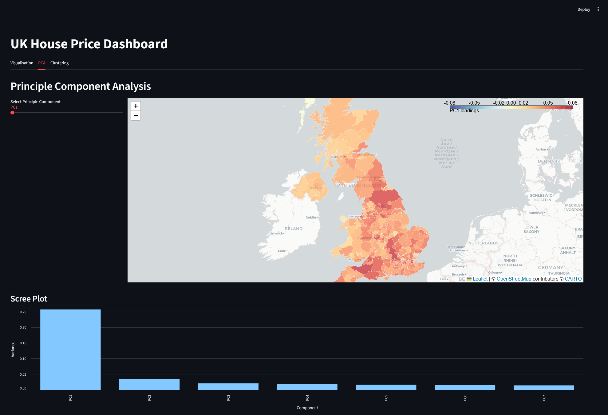
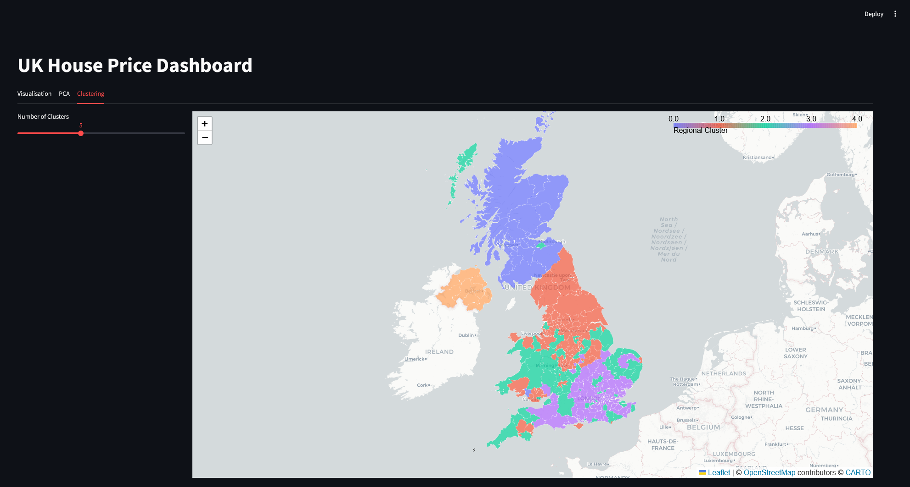

# Housing Price Dashboard

An interactive data dashboard for exploring UK house prices over time and across regions.
Built with Streamlit, Plotly, Pandas, GeoPandas, and Folium, this project provides multiple complementary views of regional house price levels, returns, and correlations.

## Usage

```
git clone https://github.com/TristanHodgson/housing-dashboard.git
cd housing-dashboard
python -m venv .venv
./.venv/Scripts/Activate.ps1
pip install -r requirements.txt
```

[Download the data](https://www.gov.uk/government/statistical-data-sets/uk-house-price-index-data-downloads-september-2025)

```
python scripts\import_data.py
```
You may need to adjust the above file to use the correct file name in the csv_file variable
```
python -m streamlit run main.py
```

## Screenshots



