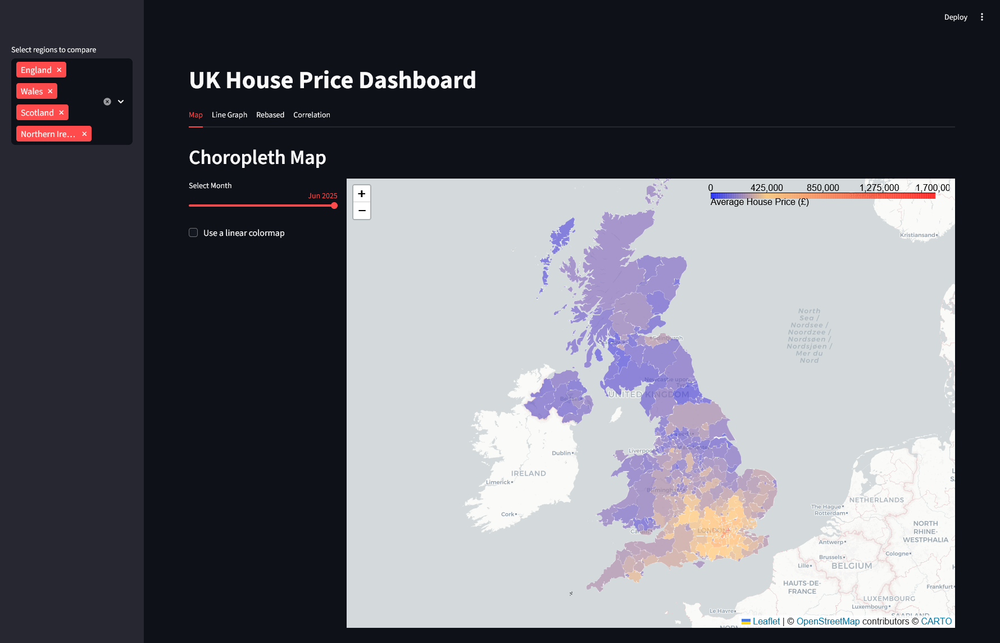
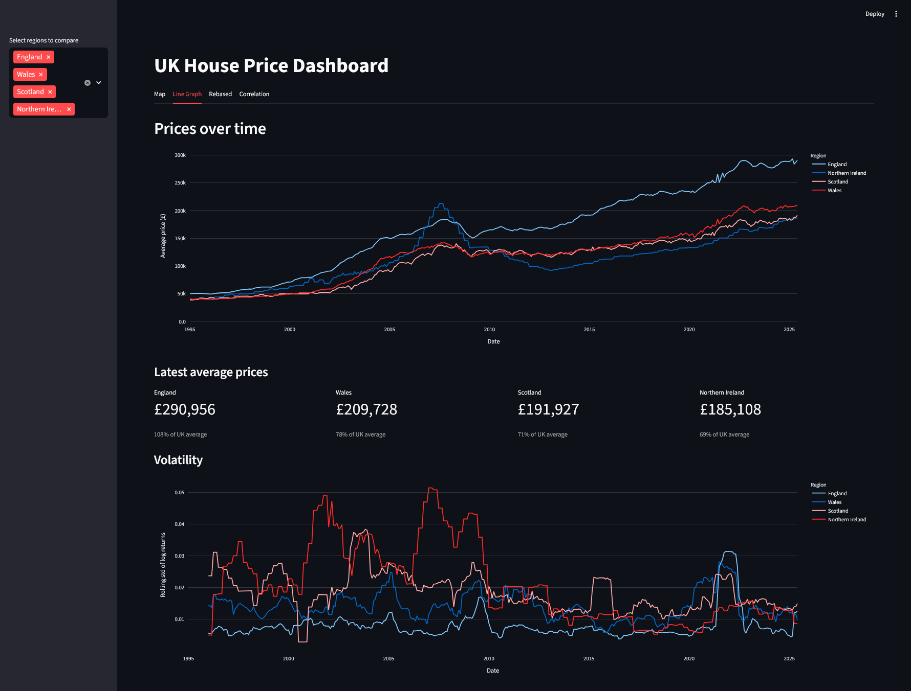
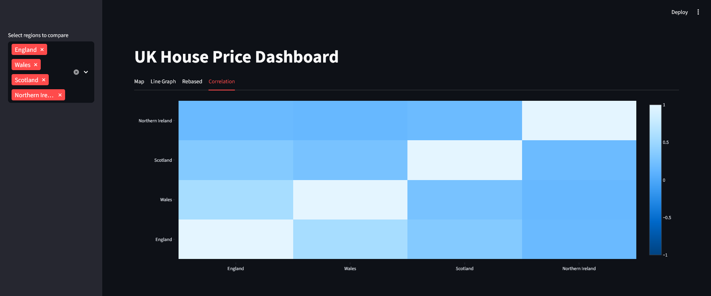

# Housing Price Dashboard

An interactive data dashboard for exploring UK house prices over time and across regions.
Built with Streamlit, Plotly, Pandas, and GeoPandas, this project turns raw housing transaction data into a visual analytical tool.

## Usage

```bash
git clone https://github.com/TristanHodgson/housing-dashboard.git
cd housing-dashboard
python -m venv .venv
./.venv/Scripts/Activate.ps1
pip install -r requirements.txt
python -m streamlit run main.py
```

## Overview

### Backend

* Data is stored in a SQLite database, queried using SQLAlchemy
* Streamlit caching is applied to database queries and geospatial data to improve performance
* Geographic boundaries are handled with GeoPandas/arcGIS and cached locally to avoid repeated external requests
* Data from the [UK government](https://www.gov.uk/government/statistical-data-sets/uk-house-price-index-data-downloads-may-2025) had to be cleaned and imported into the database using a [script](scripts/import_data.py) to ensure that all regions lined up with arcGIS regions

### Map View


* Displays an interactive choropleth map of UK house prices by local authority
* Users can select a specific month to view cross-sectional price levels
* Options for a linear (not honest) and non-linear (most useful) colour scale
* Tooltips show region names and formatted average prices for quick inspection

### Line View


* Shows historical house prices over time for selected regions
* Supports direct comparison between regions and the UK average
* Includes summary metrics showing the latest average price and relative performance versus the UK
* Displays rolling volatility of log returns to highlight changes in market stability over time in different regions


### Rebase View


* Rebases regional house prices to a common index at a user-selected month
* Enables comparison of relative growth trajectories, independent of absolute price levels
* Includes safeguards to ensure rebasing only occurs when all selected regions have data for the base month (for example NI has less data than England)

### Correlation View


* Visualises the correlation of regional price returns using a heatmap
* Helps identify which regional markets tend to move together